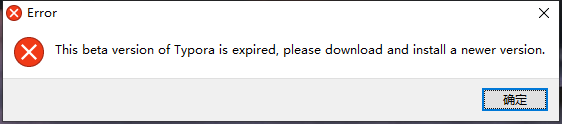

- [Markdown Tutorial](#markdown-tutorial)
  * [常用命令](#----)
  * [标题](#--)
  * [文本格式](#----)
    + [example](#example)
  * [罗列条目](#----)
    + [example](#example-1)
  * [插入公式、代码](#-------)
    + [example](#example-2)
  * [插入表格、图片、链接](#----------)
    + [example](#example-3)
  * [视频教程](#----)
- [简单破解Typora的方法](#----typora---)
  * [第一步，新建txt文件，把如下代码拷贝进去](#------txt------------)
  * [第二步，修改上面的几个参数](#-------------)
  * [第三步，结尾工作](#--------)

<small><i><a href='http://ecotrust-canada.github.io/markdown-toc/'>Table of contents generated with markdown-toc</a></i></small>


## 常用命令

| 功能       | Typora命令 | Markdown语法 |
| ---------- | ---------- | ------------ |
| 查看源代码 | Ctrl+/     |              |

## 标题

|        功能        | Typora命令 |  Markdown语法  |
| :----------------: | :--------: | :------------: |
|   设置文本为正文   |   Ctrl+0   |                |
| 设置文本为一级标题 |   Ctrl+1   |   `# title`    |
| 设置文本为六级标题 |   Ctrl+6   | `###### title` |

## 文本格式

|            功能            | Typora命令 |                    Markdown语法                    |
| :------------------------: | :--------: | :------------------------------------------------: |
|            加粗            |   Ctrl+B   |                     `**text**`                     |
|            倾斜            |   Ctrl+I   |                      `*text*`                      |
|           下划线           |   Ctrl+U   |                   `<u>text</u>`                    |
|            组合            | Ctrl+B+I+U |                `**<u>*text*</u>**`                 |
|            上标            |            |                      `^text^`                      |
|            下标            |            |                      `~text~`                      |
|            高亮            |            |                     `==text==`                     |
| 设置文本的字体，大小，颜色 |            | `<font face="黑体" color=Blue size=5 >文本<\font>` |
|            空格            |            |                      `&emsp;`                      |

### example

- [ ] **这是加粗**

- [ ] *这是倾斜*

- [ ] <u>这是下划线</u>

- [ ] **<u>*这是加粗倾斜下划线*</u>**

- [ ] cm^3^

- [ ] H~2~O

- [ ] ==这是高亮==

  注：个别格式需要打开Typora的相关设置才能正常显示

## 罗列条目

|     功能     |      Typora命令      |         Markdown语法         |
| :----------: | :------------------: | :--------------------------: |
|   无序条目   |     Ctrl+Shift+]     | `- item`或`+ item`或`* item` |
|   有序条目   |     Ctrl+Shift+[     |    `1. item` , `2. item`     |
|   方块条目   | 菜单栏-段落-任务列表 |         `- [ ] item`         |
| 方块条目勾选 |       点击方块       |         `- [X] item`         |
|  升级或降级  | Ctrl+[ ,Ctrl+] , Tab |                              |

### example

- 水果
  - 苹果
  - 橘子
- 动物
  - 猫
  - 狗

神经网络

1. CNN
2. Transformer
3. GAN

- [x] 矩阵论
- [ ] 函数论

## 插入公式、代码

|   功能   |  Typora命令  |  Markdown语法   |
| :------: | :----------: | :-------------: |
| 行内公式 |              |   `$formula$`   |
| 行间公式 | Ctrl+Shift+M |  `$$formula$$`  |
| 行内代码 |              |  `` `code` ``   |
| 行间代码 | Ctrl+Shift+K | `````code`` ``` |

### example

行内公式：$\int_0^1 x^2dx=\frac{1}{3} $

行间公式：

$$\sum\limits_{ x\in \mathbb{N}}f(x)=f(0)+f(1)+\dots+f(n)+\dots $$

行内代码：`print('Hello world!')`

行间代码块：

```python
def fun(x,y):
    return x+y
```

## 插入表格、图片、链接

| 功能     | Typora命令   | Markdown语法                                                 |
| -------- | ------------ | ------------------------------------------------------------ |
| 插入表格 | Ctrl+T       |                                                              |
| 插入图片 | Ctrl+Shift+I | `` 或`` |
| 网页链接 | Ctrl+K       | `[title](url)`或`[title](# 位置)`                            |
| 页内跳转 |              | 点击的位置`<a href="#label">title</a>`，跳转到的位置`<a id="label">title</a>` |

### example


[点击或按住Ctrl键点击进入我的github主页](https://github.com/hfut-zyw)


## 视频教程

<iframe src="//player.bilibili.com/player.html?aid=504744800&bvid=BV1Fg411j7CW&cid=384406885&page=1" scrolling="no" border="0" frameborder="no" framespacing="0" allowfullscreen="true" width="600" height="500"> </iframe>


---
---

# 简单破解Typora的方法

 

> 当你使用Typora beta等低版本的时候，是不是遇到上述问题，提示过期不能用，需要你升级最新付费版本。从网上一艘，教你修改系统时间到你之前能使用的日期，但是每次这样改来改去挺烦的，下面提供一种比较简便的方法实现一键启动Typora

## 第一步，新建txt文件，把如下代码拷贝进去

if "%1"=="hide" goto CmdBegin 
start mshta vbscript:createobject("wscript.shell").run("""%~0"" hide",0)(window.close)&&exit 
:CmdBegin 

@echo off 
date 2021-6-25 
cd C:\Program Files\Typora 
start /b Typora.exe 
echo waiting for Typora 
::update time 
net time \\xxx_server 
net stop w32time 
net start w32time 
w32tm /resync 

## 第二步，修改上面的几个参数

date 后面的日期为你能使用的时候的日期

cd 后面是你Typora程序的路径

start /b 后面的是你的程序

把这三个改对后叉掉保存

## 第三步，结尾工作

1.把txt后缀名改为bat

2.再把这个bat文件放到你的C:\Program Files\Typora目录下

3.发送这个bat文件快捷方式到桌面

4.删除原来的Typora桌面快捷方式，把这个bat快捷方式名称改为Typora

5.右击这个改过名的Typora，属性，高级，勾选以管理员身份运行

6.右击，属性，更改图标，找到Typora的安装目录，把图标变成Typora.exe即可

大功告成！以后在桌面双击这个快捷方式即可运行Typora，在不关闭的情况下，就可以随便打开其他md文件了
